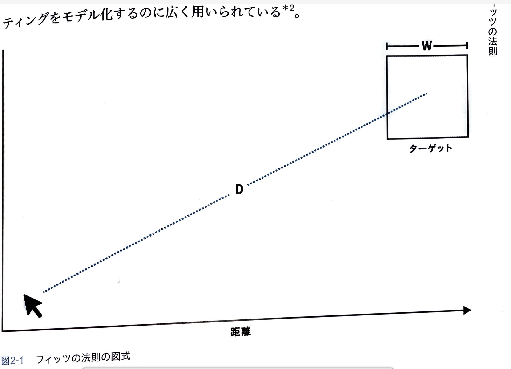
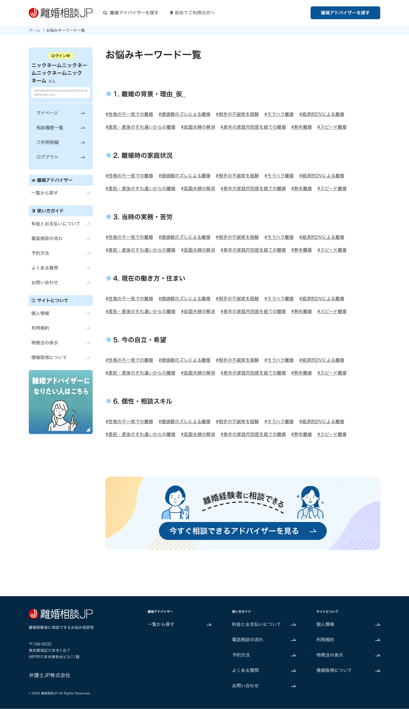

# UXデザインの3つの法則
## 実務で使える心理学

---

# 今日お話しすること

今日は、実務で即使える**3つのUX法則**

1. **フィッツの法則** - ボタンの配置とサイズ
2. **ミラーの法則** - 情報の整理術
3. **ピークエンドの法則** - 体験設計の優先順位

---

# 1. フィッツの法則（1954年）

## ターゲットへの到達時間は、距離とサイズで決まる

**ID = log₂(2D/W)**
- ID = 難易度指数（大きいほど操作が難しい）
- D = 距離（現在位置からターゲットまで）
- W = ターゲットの幅（サイズ）

---


# フィッツの法則：視覚化



異なるボタンサイズ（W）における、距離（D）と難易度（ID）の関係

---

# フィッツの法則：具体例

## 例1：大きくて近いボタン
- D = 100px、W = 50px
- **ID = log₂(2 × 100 / 50) = log₂(4) = 2** ✅ 簡単

## 例2：小さくて遠いボタン
- D = 500px、W = 10px
- **ID = log₂(2 × 500 / 10) = log₂(100) ≈ 6.6** ❌ 難しい

**IDが大きいほど、到達に時間がかかる**

---

# 実務での応用例

## スマホUI設計

左手持ちユーザーの場合：
- 親指から遠い右上の小さなボタン → **押しにくい**
- 画面下部中央の大きなボタン → **押しやすい**

💡 **重要なアクションボタンは、大きく・近い位置に配置**

⚠️ **注意：ボタンが小さすぎると誤タップも発生**
- 推奨最小サイズ：44-48px（Apple/Google推奨）
- 隣のボタンとの間隔も重要

---


---

# 実務での応用例

## フォーム設計

```
❌ 小さなチェックボックスだけクリック可能
✅ ラベルテキスト全体をクリック可能に
```

HTMLの`<label for="id">`を使うと、ラベル全体がクリック可能エリアになる
→ **W（ターゲットサイズ）が劇的に拡大**

スマホでは特に重要！

--- 

```html
<!-- 悪い例：input要素のみクリック可能 -->
<label>メールアドレス</label>
<input type="email" id="email">
<!-- W = 小さい（inputの幅のみ） -->
```

```html
<!-- 良い例：ラベル全体がクリック可能 -->
<label for="email">
  メールアドレス
  <input type="email" id="email">
</label>
<!-- W = 大きい（ラベルテキスト + input全体） -->
```

---

[📱 デモを見る（index.html）](./form.html)

---

# 2. ミラーの法則（1956年）

## 短期記憶で保持できるチャンクは7±2個

でも、**よくある誤解**があります...

---

# ミラーの法則：よくある誤解

❌ **誤解：「項目を5〜9個に減らせばいい」**

⭕ **本質：「意味のあるまとまり（チャンク）に整理する」**

---

# チャンキングの力

## 電話番号の例

**チャンキングなし（11個）：**
```
0 9 0 1 2 3 4 5 6 7 8
```

**チャンキングあり（3個）：**
```
090 - 1234 - 5678
```

項目数ではなく、**意味のあるまとまりに整理**することが重要

---

# 実務での応用例

## ナビゲーションメニュー

**悪い例：整理されていない12項目**
```
ホーム / 会社概要 / サービス / 製品A / 製品B / 製品C / 
事例 / ブログ / お知らせ / 採用 / お問い合わせ / FAQ
```

**良い例：3つのカテゴリーにチャンキング**
```
ホーム / 会社情報 / 製品・サービス / サポート
```

ユーザーは「3つのグループ」として認識できる

---

# 実務での応用例




---

# 3. ピークエンドの法則（1993年）

## 体験は「ピーク」と「エンド」で評価される

人は経験を振り返る時：
- **ピーク**（最も感情が動いた瞬間）
- **エンド**（終わりの瞬間）

この2つで全体を評価する

体験の長さや中間部分は、あまり記憶に残らない

---

# ピークエンドの法則：ユーザージャーニー

例：Eコマースサイト

```
1. 商品検索 ← まあまあでOK
2. 商品詳細 ← まあまあでOK
3. カート投入 ← まあまあでOK
4. 決済 ← ★ピーク（スムーズで安心）
5. 購入完了 ← ★エンド（温かいメッセージ）
```

**工数は、ピークとエンドに集中投下すべき**

---

# 実務での応用例

## オンライン相談サービス

```
1. ユーザー登録 ← まあまあでOK
2. オンラインミーティング ← ★ピーク
   （最も感情が動く、悩みを相談する瞬間）
3. アドバイザーからのメッセージ ← ★エンド
   （温かく寄り添うメッセージ）
```

**工数配分：登録20% / ミーティング40% / メッセージ40%**

---

# 実務での応用例

## カスタマーサポート

**悪い例：**
```
問い合わせ → 解決 → 終了
```

**良い例：**
```
問い合わせ → 解決 → 
「ご不便おかけしました。今後も何かあればお気軽にご連絡ください」
```

**エンドを良くすることで、全体の印象が向上**
→ リピート率、口コミに直結

---

# 段階的な改善アプローチ

## まずエンド、次にピーク

**フェーズ1：エンド改善（優先）**
- 購入完了画面、問い合わせ完了画面の改善
- 必ず全ユーザーが経験する
- 実装が容易、ROIが高い

**フェーズ2：ピーク創出**
- 「Wow」モーメントの設計
- サプライズ要素の追加
- クリエイティブな工夫が必要

---

# まとめ

## 3つの法則を実務で活かす

1. **フィッツの法則** - 重要なボタンは大きく、近くに
2. **ミラーの法則** - 項目数ではなく、意味のあるまとまりに整理
3. **ピークエンドの法則** - 工数はピークとエンドに集中投下


---

# 余談

今日の話は『UXデザインの法則 第2版』Jon Yablonski著（オライリー・ジャパン）をもとにしています。
けど、第２版が最近でたから、興味あれば最新の買ってね！


---

# 参考文献

- Fitts, P. M. (1954). "The information capacity of the human motor system"
- Miller, G. A. (1956). "The Magical Number Seven, Plus or Minus Two"
- Kahneman, D., et al. (1993). "When More Pain Is Preferred to Less"
- 『UXデザインの法則 第2版』Jon Yablonski著（オライリー・ジャパン）

---

# ご清聴ありがとうございました！
